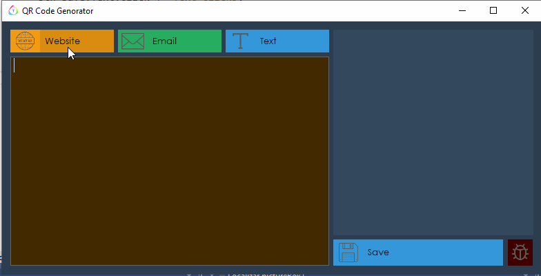

 ## ❔ About the QR-Code-Generator

This project Generates QR codes to sites, e-mails and plain texts.

## 🤝 Contributions 

Follow the steps below to contribute:

1. *Fork* the project (<https://github.com/PasanSilva99/QR-Code-Generator.git>)

2. Clone your *fork* to your machine (`git clone https://github.com/user_name/QR-Code-Generator.git`)

3. Create a *branch* to perform your modification (`git checkout -b feature/name_new_feature`)

4. Add your modifications and *commit* (`git commit -m "Describe your modification"`)

5. *Push* (`git push origin feature/name_new_feature`)

6. Create a new *Pull Request*

7. Okay, now just wait for the analysis

